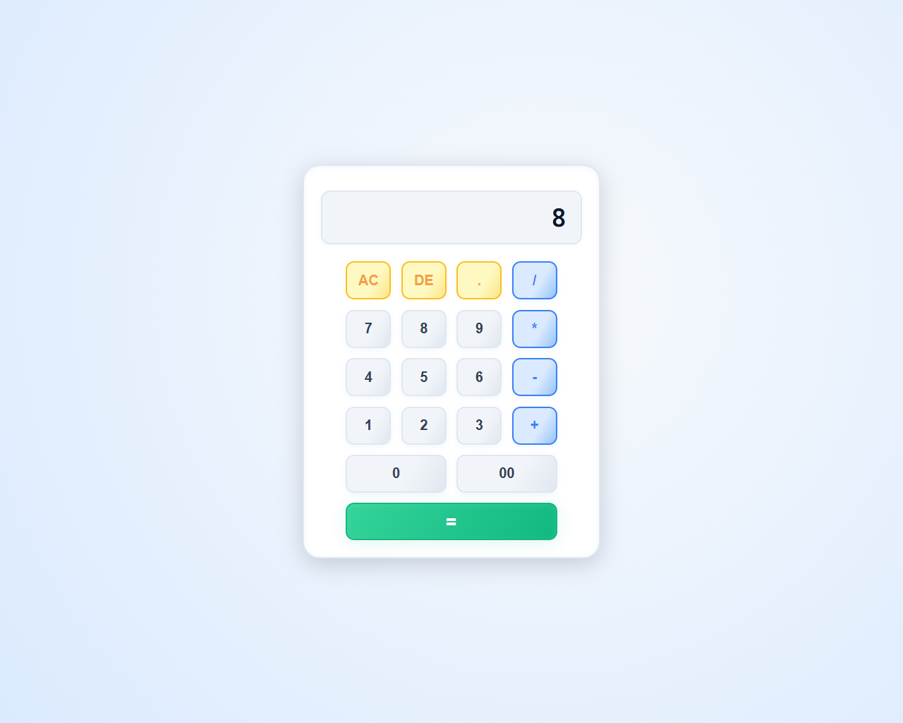

# Simple Calculator

A minimal yet stylish web-based calculator built with **HTML**, **CSS**, and **Vanilla&nbsp;JavaScript**. It performs the four basic arithmetic operations and demonstrates modern UI/UX practices with responsive design.



---

## Features

- Addition, subtraction, multiplication and division
- Clear entire expression (`AC`)
- Delete the last character (`DE`)
- Supports decimal numbers
- Keyboard-friendly input field (read-only to avoid accidental edits)
- Fully responsive and accessible design

## Getting Started

1. **Clone or download** this repository.
2. Navigate to the `Simple Calculator` project folder.
3. Open `index.html` in your favourite browser – that’s it! No build tools or dependencies required.

```
📂 [12] Simple Calculator/
├── index.html   ← main HTML markup
├── style.css    ← calculator styling
├── script.js    ← calculator logic
└── image/       ← icons & screenshots
```

## Usage

Click the buttons to compose an arithmetic expression, then press `=` to evaluate it.

```
7 + 8 * 2 / 4 - 3 = 8
```

Use `AC` to clear the entire display or `DE` to delete the last character.

> ⚠️  This demo relies on JavaScript’s built-in `eval()` for simplicity. In production apps consider using a safer expression parser.

## Built With

- HTML5 semantic markup
- Modern CSS (Flexbox + Grid, custom properties, media queries)
- Vanilla JavaScript

## Demo

Demo Url : https://simplle-calculatorr.vercel.app/
