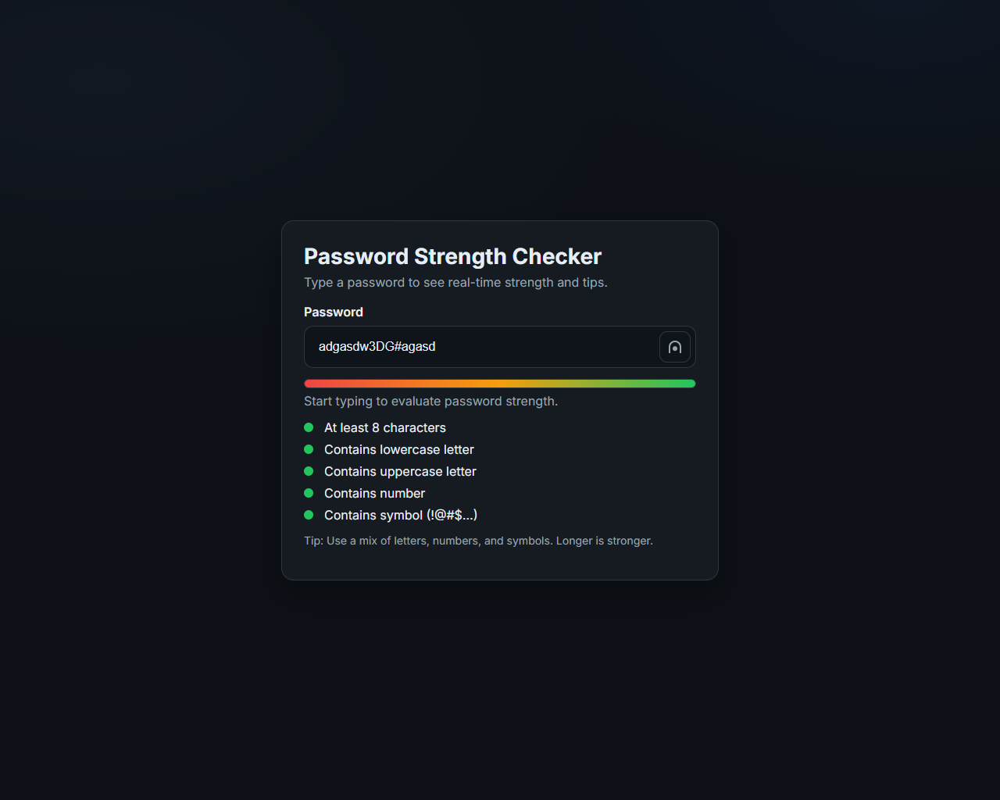

# Show Password Strength

A responsive, accessible password strength checker built with HTML, CSS, and JavaScript. It provides a live strength meter, requirement checklist, and a show/hide toggle.

## Features

- **Live strength meter** with smooth progress animation
- **Requirement checklist** (length, lower, upper, number, symbol)
- **Instant feedback** text (Very weak → Strong)
- **Show/Hide** password visibility toggle
- **Accessible**: ARIA roles, polite announcements, keyboard-friendly
- **Responsive** dark UI with clean layout

## Project structure

```
├── 📖 README.md
├── 🌐 index.html
├── 📄 main.js
└── 🎨 style.css
```

# Screen Shot



## How it works

- The input value is evaluated against five requirements:
  - At least 8 characters
  - Contains lowercase letter (a–z)
  - Contains uppercase letter (A–Z)
  - Contains number (0–9)
  - Contains symbol (non-alphanumeric)
- Score is derived from how many requirements pass, with small bonuses for length ≥ 12 and full variety. The score maps to a percentage to fill the meter and to a label:
  - 0–19: Very weak
  - 20–39: Weak
  - 40–59: Fair
  - 60–79: Good
  - 80–100: Strong
- The checklist highlights each met requirement in real time.

## Usage

1. Open `index.html` in your browser.
2. Type a password to see the live meter and checklist updates.
3. Click the eye button to show or hide the password.

## Customization

- **Rules**: Adjust the regex patterns and thresholds in `main.js`:
  - `patterns.lower`, `patterns.upper`, `patterns.number`, `patterns.symbol`
  - Minimum length in `evaluatePassword`
- **Scoring**: Modify bonuses and mapping in `evaluatePassword` and `updateUI`.
- **Colors/Theme**: Update CSS variables in `style.css` under `:root`.

## Accessibility

- Meter uses `role="progressbar"` with `aria-valuenow` mirrored by the visual fill.
- Status text uses `aria-live="polite"` for non-intrusive updates.
- Visibility toggle uses `aria-pressed` state.

## Browser support

Modern evergreen browsers (Chrome, Edge, Firefox, Safari). Uses standard ES6 and modern CSS.

## License

MIT — use freely for learning or production with attribution.
