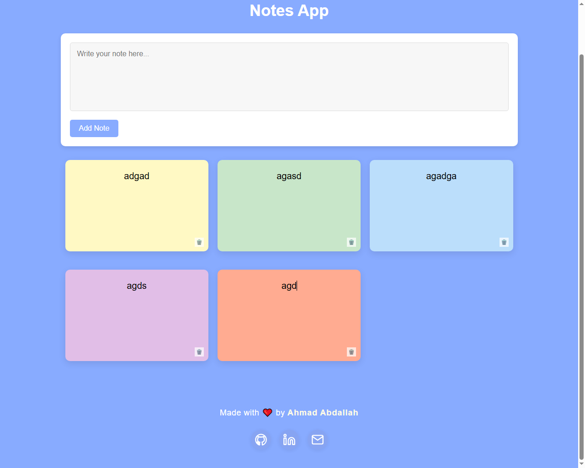

# Notes App

A sleek, colourful notes-taking web app built with **HTML**, **CSS** and **JavaScript**.
Type a thought, click **Add Note**, and it is instantly saved – even after you refresh the page.

---

## ✨ Features

| Feature                  | Description                                                                                                                    |
| ------------------------ | ------------------------------------------------------------------------------------------------------------------------------ |
| 📝 **Add / Edit Notes**  | Write anything in the textarea and press **Add Note**. Notes are fully _content-editable_ – click any note to update its text. |
| 🗑️ **Delete Notes**      | Each note has a trash icon; one click removes the note.                                                                        |
| 🎨 **Colourful Layout**  | Notes alternate between soft pastel colours for quick visual distinction.                                                      |
| 💾 **Auto-Save**         | All notes are stored in **localStorage**. Additions, edits and deletions are saved automatically.                              |
| ⚠️ **Input Validation**  | An error message prevents empty notes from being added.                                                                        |
| 📱 **Responsive Design** | CSS Grid adapts the layout from mobile to desktop.                                                                             |
| ❤️ **Animated Footer**   | A pulse-animated heart and interactive social icons (GitHub, LinkedIn, Gmail).                                                 |

---

## 🚀 Quick Start

1. **Clone** the repository

   ```bash
   git clone https://github.com/ahmadabdallahh/30-Day-30-Projects-for-Begginers-Great_Stack.git
   cd "30 Day - 30 Projects for Begginers"/[5] Notes App
   ```

2. **Open** `index.html` in your favourite browser – no build step required.

---

## 🖥️ Usage

1. Type your note in the textarea.
2. Click **Add Note** – the note appears in the grid.
3. Click inside any note to edit its text; click the trash icon to delete it.
4. Reload the page – your notes remain thanks to localStorage.

---

## 🗂️ File Structure

```
[5] Notes App/
├── index.html   # Mark-up
├── style.css    # Styling + animations
├── main.js      # App logic (CRUD + persistence)
├── notepad.ico  # Favicon
└── image/
    └── delete.png  # Trash icon
```

---

## 🛠️ Built With

- HTML5 semantic elements
- Modern CSS (Flexbox, Grid, keyframe animations)
- Vanilla JavaScript (ES6)

---

## 📸 Screenshots



---

## 📄 License

Released under the MIT License – see the [LICENSE](../../LICENSE) file for details.
